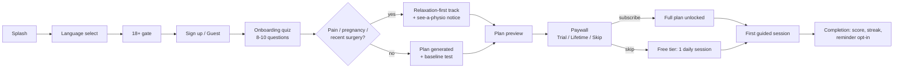

# 02 · Features, User Flows & Information Architecture

## Complete feature list

### Free tier
- 18+ age gate, account creation (email / Google / phone OTP) or guest mode
- Language selection (12 languages, changeable anytime)
- Full onboarding quiz + generated plan **preview** (plan visible, locked beyond level 1)
- **One basic guided Kegel session per day** (Beginner Foundation, 3-minute)
- Muscle-identification guide + 3 starter articles
- One daily reminder (fixed time chosen by user)
- Basic history: sessions completed, current streak

### Premium tier (₹999/mo or ₹2,999 lifetime)
- Personalized full training plan (7-stage progressive program, auto-adapting)
- All session types: endurance holds, quick flicks, reverse Kegels/relaxation,
  functional & breathing integration, expert challenges
- Guided player extras: voice instructions (per language), audio tones, vibration
  cues, breathing circle, rest coaching
- Progress analytics: weekly/monthly charts, Control Score trend, milestones
- Full gamification: XP, levels, badges, weekly goals, monthly challenges,
  certificates, milestone celebrations
- Smart reminders (adaptive timing, missed-workout nudges, weekly summaries)
- Complete education library (articles, videos, FAQs) in all languages
- Cloud sync & multi-device, priority future features

### Cross-cutting
- Offline-capable sessions (plan cached; sync when online)
- App lock (PIN/biometric), discreet icon option, in-app data delete
- Push notifications with per-category opt-out
- Analytics + crash reporting (anonymized)

## Primary user flows

### 1. First launch → first session (target: < 3 minutes)


### 2. Daily loop (retention engine)
Reminder → open app → Today card (one tap to start) → guided session
(squeeze/relax with breathing circle, voice, haptics) → completion celebration
(XP, streak, score estimate) → optional check-in mood/difficulty → schedule
tomorrow. Missed day → gentle recovery message (streak freeze if premium).

### 3. Upgrade flow
Free session complete → contextual upsell ("Level 2 unlocks…") → paywall →
Play Billing / App Store purchase sheet (UPI, cards, net-banking inside store
checkout) → RevenueCat entitlement → instant unlock. Restore purchases from
Settings. Also: locked-content taps and week-2 discount notification.

### 4. Language change
Settings → Language → instant UI switch (no restart); voice guidance re-downloads
per-language audio pack in background; content falls back to English if a
translation is missing (flagged to admin).

## Information architecture

```
App
├── Today (home)            — today's session card, streak, weekly goal ring
├── Program                 — 7-stage map, current level, plan details
├── Progress                — charts, Control Score, calendar, achievements
├── Learn                   — technique guide, articles, videos, FAQs
└── Profile / Settings
    ├── Account, subscription, restore purchases
    ├── Language, reminders & notification categories
    ├── Sound / voice / vibration
    ├── App lock, discreet icon
    ├── Privacy: export & delete data
    └── Help, disclaimers, terms & privacy
```

Session player and paywall are modal layers above the tab structure.
Admin panel is a separate web app (doc 10).

## Screen inventory (wireframes: `wireframes.html`)

Splash · Language · Age gate · Auth · Onboarding (quiz) · Safety branch ·
Plan reveal · Baseline test · Paywall · Today · Session player · Completion ·
Program map · Progress dashboard · Achievements · Learn hub · Article ·
Settings · Reminder setup · Manage subscription.
