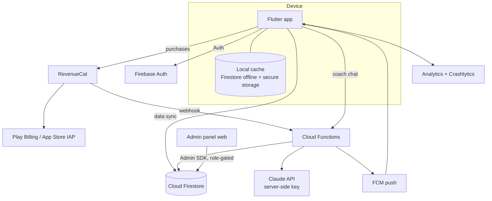

# 07 · Technical Architecture

## Recommended stack

| Layer | Choice | Why |
|---|---|---|
| Mobile app | **Flutter** (one codebase, Android + iOS) | Per Alpha Man brief; best animation performance for the breathing circle; first-class i18n (`intl`/ARB); large Indian dev talent pool |
| Auth | **Firebase Auth** (email, Google, phone OTP) | Phone OTP is essential in India |
| Database | **Cloud Firestore** | Offline persistence built-in, realtime sync, scales |
| Server logic | **Cloud Functions (TypeScript)** | RevenueCat webhooks, plan generation, AI coach proxy, notification scheduling, certificates |
| Subscriptions | **RevenueCat** wrapping Google Play Billing + App Store IAP | See doc 08 |
| Push | Firebase Cloud Messaging + local notifications (reminders work offline) | |
| Analytics / crashes | Firebase Analytics + Crashlytics | Funnels: onboarding, paywall, D1/D7/D30 |
| Remote config | Firebase Remote Config | Paywall copy tests, challenge config |
| AI coach (premium, phase 2) | Claude via Cloud Function proxy — API key server-side only, guardrailed system prompt (wellness-only, refuses diagnosis, escalates red flags) | |
| Admin panel | Web app (Next.js or Flutter Web) on Firebase Hosting, Firestore + admin SDK | Doc 10 |

## System diagram



## Database schema (Firestore)

```
users/{uid}
  profile: { displayName, gender, ageBand, language, createdAt, discreetMode }
  onboarding: { answers{...}, safetyFlags[], completedAt }          // sensitive
  plan: { stage, week, params{holdSec,restSec,reps,sets,flickSets},
          emphasis, generatedAt, version }
  score: { control: 62, seededAt, history: subcollection }
  gamification: { xp, level, streak, bestStreak, freezes, weeklyGoal }
  settings: { reminders[], sound, voice, haptics, appLock, notifCategories{} }

users/{uid}/sessions/{sessionId}
  { date, stage, type, durationSec, repsDone, difficultyRating, mood, offlineSynced }

users/{uid}/achievements/{badgeId}   { earnedAt }
users/{uid}/scoreHistory/{month}     { control, selfTest{holdSec,flicks10s} }

subscriptions/{uid}                  // written ONLY by RevenueCat webhook (CF)
  { entitlement: none|monthly|lifetime, store, expiresAt, status }

content/{articleId}
  { type: article|video|faq, stagePremium: bool, publishedAt,
    locales: { en:{title,body,mediaUrl}, hi:{...}, ta:{...}, ... } }

programTemplates/{templateId}        // protocol tables, versioned, admin-editable
challenges/{challengeId}             // monthly challenges config
adminUsers/{uid}                     { role: owner|editor|support }
```

**Security rules:** users read/write only their own tree; `subscriptions`,
`content`, `programTemplates`, `challenges` are client-read-only;
admin writes require `adminUsers` role via custom claims. Onboarding answers
(health-adjacent) never leave the user's tree, excluded from analytics.

## API architecture (Cloud Functions)

| Endpoint | Trigger | Purpose |
|---|---|---|
| `generatePlan` | callable | Runs personalization matrix server-side (single source of truth, versioned) |
| `revenuecatWebhook` | HTTPS | Entitlement sync → `subscriptions/{uid}` |
| `coachChat` | callable, entitlement-gated | Claude proxy w/ guardrails + rate limit |
| `scheduleDigests` | cron | Weekly summaries, missed-workout nudges via FCM |
| `issueCertificate` | callable | Localized PDF on program completion |
| `deleteAccount` | callable | Full erasure: auth + Firestore + RevenueCat alias + analytics reset |
| `adminApi` | HTTPS, role-gated | Panel operations not doable via rules |

## Security & privacy

- TLS everywhere; Firestore encryption at rest; device cache in
  encrypted storage (`flutter_secure_storage` for keys, encrypted Hive/Isar for cache).
- Data minimization: no real names required; health answers stored under uid only,
  never in analytics events; analytics use coarse properties (stage, language) only.
- In-app **export** and **delete** (DPDP Act 2023 + GDPR-grade hygiene).
- 18+ gate stored as attestation; no children's data.
- App lock; FLAG_SECURE on sensitive screens.
- Store compliance: Play "Health apps" & Data Safety declarations; Apple Health
  & sensitive-data guidelines; both stores' subscription disclosure rules.

## Offline strategy

Plan + current week's sessions + voice-pack cached on device; sessions log
locally and sync opportunistically; streaks computed on-device with server
reconciliation (last-write-wins on day granularity); reminders are local
notifications so they fire without network.

## Performance targets

Cold start < 2.5s on a mid-range Android (₹12k device class); session player
steady 60fps; app size < 40MB initial (voice packs on-demand per language);
Crashlytics crash-free sessions ≥ 99.5%.
