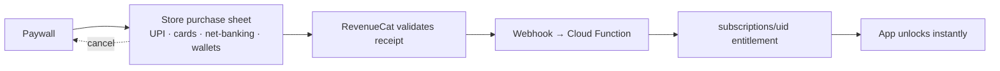

# 08 · Subscription Model & Payments

## Plans

| Plan | Price | Contents |
|---|---|---|
| **Free** | ₹0 | 1 basic daily session, starter education, 1 daily reminder, basic streak |
| **Premium Monthly** | **₹999/month** | Everything unlocked (docs 02, 06) · 7-day free trial recommended |
| **Complete Course (Lifetime)** | **₹2,999 one-time** | Everything, forever — positioned as the hero offer ("less than 3 months of monthly") |

Store products: `premium_monthly_999` (auto-renewing subscription),
`lifetime_2999` (non-consumable one-time purchase). Prices set in INR in both
consoles; other markets via store price templates later.

## The payment-gateway reality (important)

The brief asks for UPI / cards / net-banking / wallets. For **digital content
inside the app**, Google Play and the App Store **require their own billing
systems** — a direct Razorpay/UPI integration in-app for subscriptions would get
the app rejected. The good news: **Google Play checkout in India already
supports UPI, cards, net-banking, and wallets**, and the App Store supports
UPI/cards — so users still pay exactly the way the brief intends, through the
store sheet. (User-choice billing on Play can be explored later; it still
requires Play Billing alongside and saves only ~4%.)

**RevenueCat** wraps both stores: one SDK, server-verified entitlements,
webhooks, receipt validation, restore, upgrade/downgrade, churn analytics.
This also matches the Alpha Man brief ("RevenueCat + Google Play Billing — not
Razorpay"). Razorpay becomes relevant only if a **web checkout** (sold outside
the apps) is added later — legally fine and store-compliant if not linked from
inside the app (Play) / handled per current external-purchase rules (Apple).

## Subscription flow

- **Trial:** 7 days on monthly (store-managed). Reminder on day 5 ("trial ends
  in 2 days") — builds trust, reduces refunds/chargebacks.
- **Grace & recovery:** store grace period on (16 days Play / per Apple);
  in-app "payment issue" banner; win-back offer via Remote Config.
- **Restore purchases:** Settings + paywall footer; RevenueCat `restore`.
- **Lifetime upgrade:** monthly subscriber buying lifetime → show prorated
  guidance ("cancel monthly after purchase" is store-managed; RevenueCat
  entitlement dedupes).
- **Refunds:** store-handled; webhook downgrades entitlement automatically.
- **Cancellation:** deep-link to store subscription management; exit survey
  (1 tap, optional).

## Paywall design

- Shown after plan generation (value first), skippable — free tier is real.
- Two cards: Lifetime (highlighted, "BEST VALUE") and Monthly (with trial).
- Localized pricing strings from the store (never hard-coded ₹).
- Honest copy: what's included, renewal terms, cancel-anytime — compliance with
  both stores' subscription transparency rules.
- No fake countdowns or dark patterns.
- Contextual re-entry points: locked stage tap, locked article tap, week-2 offer.

## Metrics to track

Paywall view→start-trial rate, trial→paid conversion, monthly↔lifetime mix,
D30 retention by tier, refund rate, LTV by acquisition source (Firebase
Analytics + RevenueCat charts).
